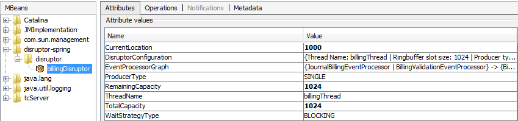

Spring Boot managed LMAX Disruptor Example project
==================
This project uses [disruptor-spring-manager](https://github.com/anair-it/disruptor-spring-manager) to create disruptor spring beans and perform message transactions. 
The project uses spring boot to load up the application as a JMS listener. Integration with IBM Websphere MQ is required to run this project. Ofcourse you can make minor modifications to get this running against ActiveMQ etc.      

The example uses 2 disruptor beans. One to process billing records and another to process data streams. Both disruptors are configured as spring beans.

Software pre-requisite
--------
1. JDK 8+
2. Maven 3+
3. Git      
4. IBM Websphere MQ 7.5 server and client jars
5. Spring boot 1.5.x          

Setting up your environment
----
1. Create a local queue manager. Name it as you wish.   
2. Create a billing input queue. Name it as your wish.     
3. Create a data stream input queue. Name it as your wish.         
3. Start queue manager    
4. Update _src/main/resources/application.yml_ with queue manager and queue names  

Configuring the disruptor
----------

[Billing disruptor spring configuration](src/main/webapp/WEB-INF/spring-billing-disruptor.xml) is based on the Consumer Dependency diamond graph that looks like this:

	                                       |     journalBillingEventProcessor     |     billingBusinessEventProcessor                 |
	                                       |    /                                 |    /                                              |
	                                       |   /                                  |   /                                               |
	billingEventPublisher -> Ring Buffer ->|  -                                   |  -  corporateBillingBusinessEventProcessor        | -billingOutboundFormattingEventProcessor
	                                       |   \                                  |   \                                               |
	                                       |    \                                 |    \                                              |
	                                       |     billingValidationEventProcessor  |     customerSpecificBillingBusinessEventProcessor |

---------
[Data Stream disruptor spring configuration](src/main/webapp/WEB-INF/spring-datastream-disruptor.xml) is based on the Consumer Dependency diamond graph that looks like this:

	                                          |                                  |    processADataStreamEventProcessor  |
	                                          |                                  |   /                                  |
	                                          |                                  |  /                                   |
	dataStreamEventPublisher -> Ring Buffer ->| - journalBillingEventProcessor   |                                      | -formatDataStreamEventProcessor
	                                          |                                  |  \                                   |
	                                          |                                  |   \                                  |
	                                          |                                  |    processBDataStreamEventProcessor  |

Components
----
1. [BillingRecord](src/main/java/org/anair/billing/model/BillingRecord.java) represents a Billing data model.        
2. [BillingEvent](src/main/java/org/anair/billing/disruptor/eventfactory/BillingEvent.java) is used to preload the ringbuffer with BillingRecord objects so that they don't get GCed.          
3. [BillingServiceImpl](src/main/java/org/anair/billing/service/BillingServiceImpl.java) performs billing business logic.    
4. [BillingEventPublisher](src/main/java/org/anair/billing/disruptor/publisher/BillingEventPublisher.java) prepares to publish billing records to the ring buffer       
5. [BillingEventTranslator](src/main/java/org/anair/billing/disruptor/eventtranslator/BillingEventTranslator.java) actually puts the data in ring buffer   
6. [Event Processors/consumers](src/main/java/org/anair/billing/disruptor/eventprocessor) consume off the ring buffer and can perform parallel operations on the data    
4. [BillingMessageListener](src/main/java/org/anair/billing/message/listener/BillingMessageListener.java) receives the MQ message and calls BillingEventPublisher.       
5. [Billing Disruptor bean configuration](src/main/resources/spring-billing-disruptor.xml)
6. [Data stream Disruptor bean configuration](src/main/resources/spring-datastream-disruptor.xml)                             
7. [Spring configuration files](src/main/resources)                      

Run it
----
1.Start application    
	
	mvn clean package
	java -jar target/disruptor-billing.jar
You will see the following log messages that prints the disruptor configuration and dependency graph:

	15:58:17.269 localhost-startStop-1 INFO [BaseDisruptorConfig] Created and configured LMAX disruptor {Thread Name: billingThread | Ringbuffer slot size: 1024 | Producer type: SINGLE | Wait strategy: BLOCKING}
	15:58:17.279 localhost-startStop-1 INFO [DefaultDisruptorConfig]
	{JournalBillingEventProcessor | BillingValidationEventProcessor} -> {BillingBusinessEventProcessor | CorporateBillingBusinessEventProcessor | CustomerSpecificBillingBusinessEventProcessor}
	{BillingBusinessEventProcessor | CorporateBillingBusinessEventProcessor | CustomerSpecificBillingBusinessEventProcessor} -> {BillingOutboundFormattingEventProcessor}
	15:58:17.289 localhost-startStop-1 INFO [JmxDisruptor] disruptor-spring:name=billingDisruptor,type=disruptor MBean defined for Disruptors.
	
2.Drop a message to any/both input queue. The message should be a long that relays the number of billing messages to be generated and processed.
If you put in message of "20", 20 messages will be processed and here is the log output summary:

	16:11:37.189 billingListenerContainer-1 INFO [BillingEventTranslator] Published Id [0] to sequence: 0
	16:11:37.189 billingListenerContainer-1 INFO [BillingEventTranslator] Published Id [10] to sequence: 10
	16:11:37.199 billingThread-1 INFO [BillingValidationEventProcessor] Sequence: 0. Id [0]
	16:11:37.269 billingThread-1 INFO [BillingValidationEventProcessor] Sequence: 10. Id [10]
	16:11:37.199 billingThread-2 INFO [JournalBillingEventProcessor] Sequence: 0. Id [0]
	16:11:37.289 billingThread-3 INFO [BillingBusinessEventProcessor] Sequence: 0. Id [0]
	16:11:37.289 billingThread-4 INFO [CustomerSpecificBillingBusinessEventProcessor] Sequence: 0. Id [0]
	16:11:37.299 billingThread-5 INFO [CorporateBillingBusinessEventProcessor] Sequence: 0. Id [0]
	16:11:37.299 billingThread-2 INFO [JournalBillingEventProcessor] Sequence: 10. Id [10]
	16:11:37.309 billingThread-4 INFO [CustomerSpecificBillingBusinessEventProcessor] Sequence: 10. Id [10]
	16:11:37.309 billingThread-3 INFO [BillingBusinessEventProcessor] Sequence: 10. Id [10]
	16:11:37.309 billingThread-6 INFO [BillingOutboundFormattingEventProcessor] Sequence: 0. Id [0]
	16:11:37.309 billingThread-5 INFO [CorporateBillingBusinessEventProcessor] Sequence: 10. Id [10]
	16:11:37.310 billingThread-6 INFO [BillingOutboundFormattingEventProcessor] Sequence: 10. Id [10]

JMX
---
1.On application context startup, all Disruptor beans will be automatically identified and registered as MBeans         
2.View Disruptor MBeans through JConsole/Visual VM that looks like: 
